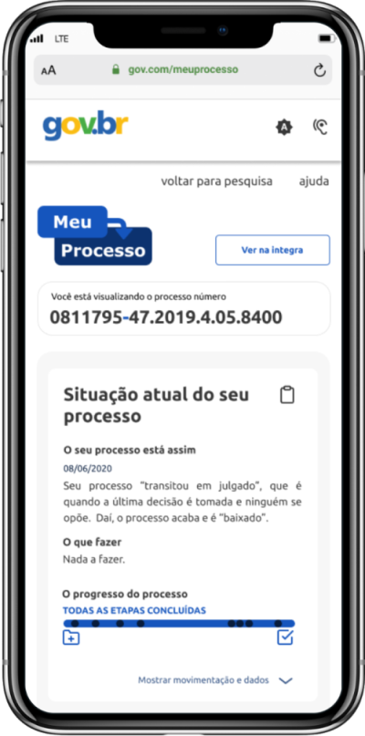

<h1 align ="center" display= 'flex'>
    </img>
</h1>

## Meu Processo 🚀 em construção... 🚧

## 💻 Sobre o projeto

Meu Processo é uma plataforma PWA que almeja ser o novo canal da Justiça Federal para apoiar o cidadão na busca por informações de seu processo e de seu andamento, de forma que qualquer pessoa possa entender.

Nossa plataforma conta com um detalhado dashboard, que com base nas tecnologias de ciência de dados, pudemos realizar a mineração das informações referente ao processo desejado e apresentá-lo em sua maior completude.

## 🛠 Tecnologias

Front End

- React
- Typescript
- jQuery

Back End

- Node.js
- Typescript
- Express
- MongoDb

## 🎨 Layout
> O [layout](https://www.figma.com/file/sZyJwCtAhSifF9WzVDsoXK/Meu-Processo?node-id=22%3A213) da aplicação está disponível no Figma:

## 🤖 Equipe
- [Bianca](https://github.com/bkkater)
- [Paulo](https://www.linkedin.com/in/paulodocarmo/)
- [Guilherme](https://www.linkedin.com/in/guilherme-s-carmo/)
- [Rodrigo](https://www.linkedin.com/in/rodrigo-de-ara%C3%BAjo-tem%C3%B3teo-42020317/)
- [Abner](https://www.linkedin.com/in/abnerdev/)

## Endpoints

### Carregar Processo

> ### Caso de sucesso:
1. ✅ Recebe uma requisição do tipo **GET** na rota **/api/processo/:numero_processo/:cpf_usuario**
1. ✅ Valida dados obrigatórios **numero_processo** e **cpf_usuario**
1. ✅ Carrega os dados do processo
1. ✅ Retorna 200

> ### Exceções:
1. ✅ Retorna erro 404 se a API não existir
1. ✅ Retorna erro 404 se **numero_processo** ou **cpf_usuario** não forem fornecidos pelo client
1. ✅ Retorna erro 500 se der erro ao tentar carregar o processo